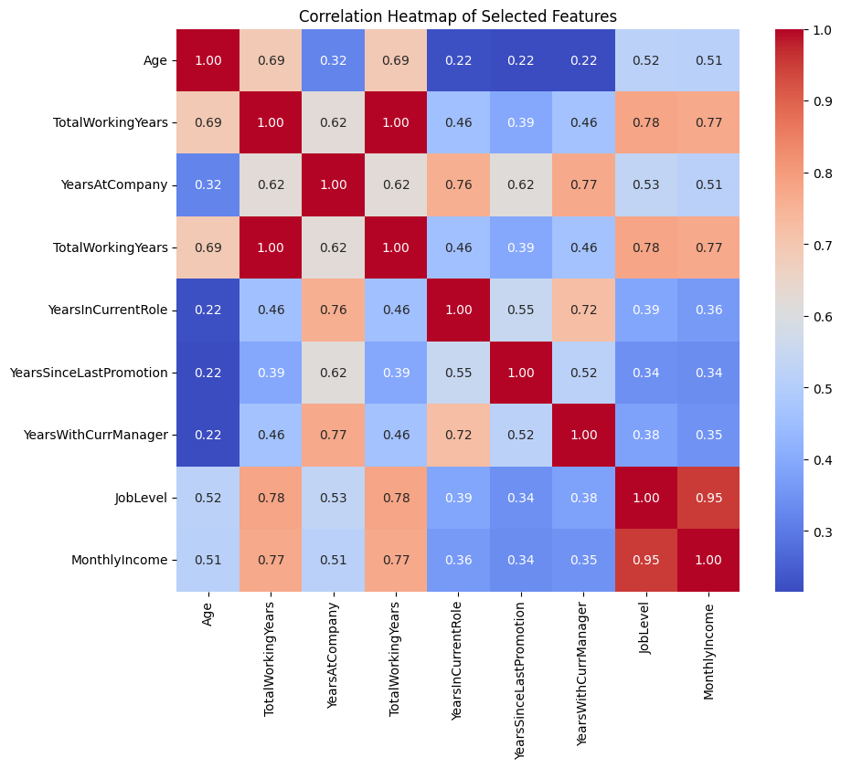

JOB TENURE APPLICATION
======================

Mission Statement
-----------------
To improve the welfare of medical personnel so as to increase better delivery of medical services.

Reason for the app
------------------

I chose to work on an app that predicts how many years someone will spend in a company, specifically focusing on medical personnel. This prediction is based on various factors such as age, total working years, job level, and other career-related variables. The goal is to provide healthcare organizations with insights into employee retention and career growth, which can be crucial for improving the welfare of medical personnel. 

The data was extracted from Kaggle at https://www.kaggle.com/datasets/jpmiller/employee-attrition-for-healthcare/data?select=watson_healthcare_modified.csv

It has 35 columns but only 8 were used to make the model depending on the correlation with the target variable which is Years_At_Company.

These are the relationships between the columns that were used

.png)

API Endpoint
------------

This API provides predictions based on input values using machine learning models (Linear Regression, Decision Tree Regressor, and Random Forest). The best-performing model has been deployed as a REST API.

API URL
You can access the prediction API at the following public URL:

https://api-durq.onrender.com/

Method: POST

Request Body (JSON):

{
    age: float  
    total_working_years: float,
    years_in_current_role: float,
    years_since_last_promotion: float,
    years_with_curr_manager: float,
    job_level: float,
    monthly_income: float,
}
Response (JSON):

{
  "prediction": int
}
Swagger UI for Testing
You can test the API using Swagger UI by visiting the following link:

https://api-durq.onrender.com/docs

Swagger UI provides an interactive interface for sending requests to the API and viewing responses.

Mobile App
-----------

This app allows users to input values and get predictions from the API in real-time.

Instructions to Run the Mobile App
Clone the repository:

 
git clone https://github.com/MKangabire/linear_regression_model.git
Navigate to the project folder:

 
cd linear_regression_model

Install Flutter (if you haven't already): Follow the installation guide on the Flutter website.

### Run flutter pub get to install the required dependencies:

### Run the app: Connect your emulator or device, then run:

flutter run

The app will start, and you can input values for the following features to get predictions from the model:

Age: The age of the employee.
Total Working Years: Total number of years the employee has worked in their career.
Job Level: The level or rank of the employee within the company.
Years in Current Role: Number of years the employee has spent in their current position.
Years Since Last Promotion: The time in years since the employee's last promotion.
Years with Current Manager: Duration in years the employee has been working with their current manager.
Monthly Income: The employee’s monthly income.
Once you input these values, the app will use the machine learning model to predict how many years the employee will likely stay at the company.

YouTube Demo
You can watch a demo of the mobile app and how it interacts with the API here:

[Demo Video (2 minutes)](https://drive.google.com/file/d/1EvXOjwYqWGygexRpijTr3BMNkT1kMEq7/view?usp=sharing)

### Technologies Used
API: FastAPI, Python
Machine Learning: Scikit-learn, Linear Regression, Decision Tree, Random Forest
Mobile App: Flutter
API Documentation: Swagger UI